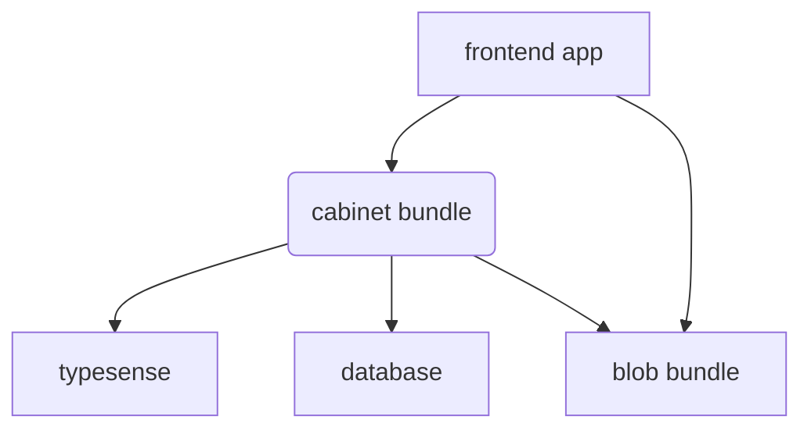

# Overview

Source: https://github.com/digital-blueprint/dbp-relay-cabinet-bundle

This bundle provides an API for managing student records.

## Installation Requirements

* A MySQL/MariaDB database

## Documentation

* [Configuration](./config.md)
* [Database](./database.md)
* [API](./api.md)
* [CLI Commands](./cli.md)
